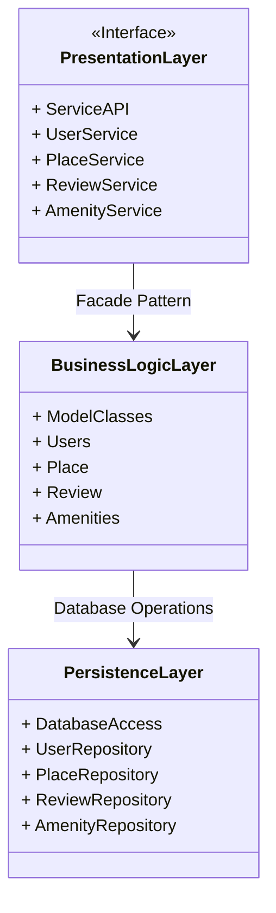
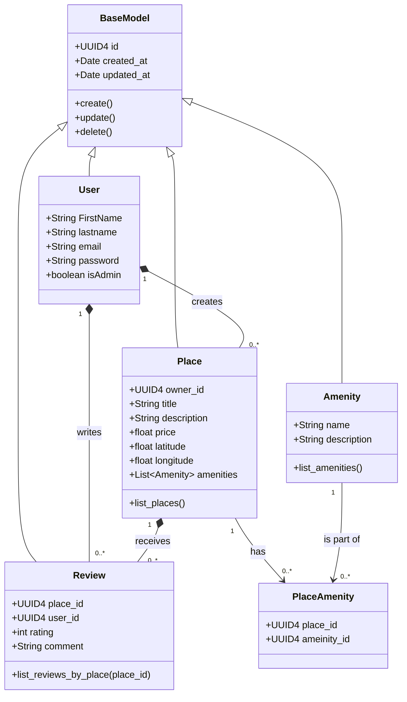
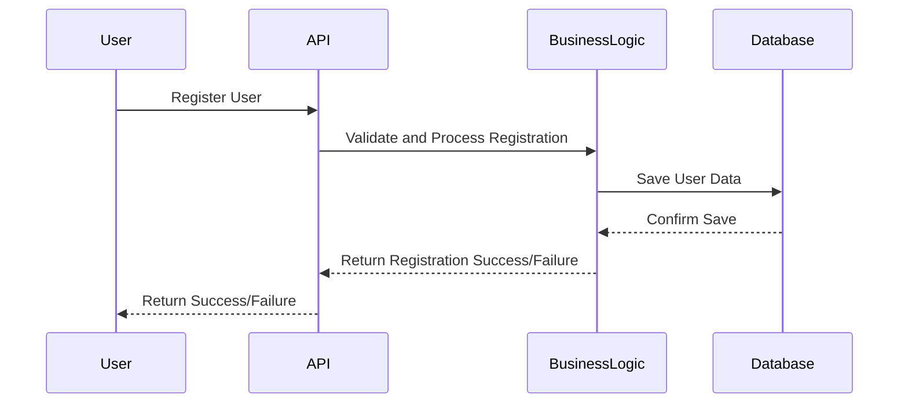
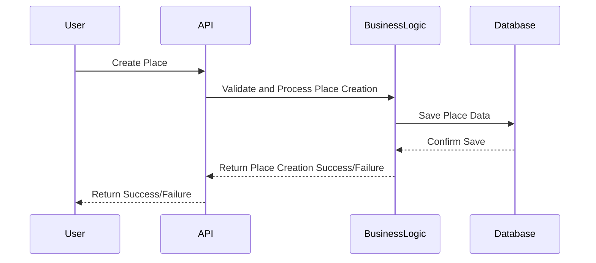
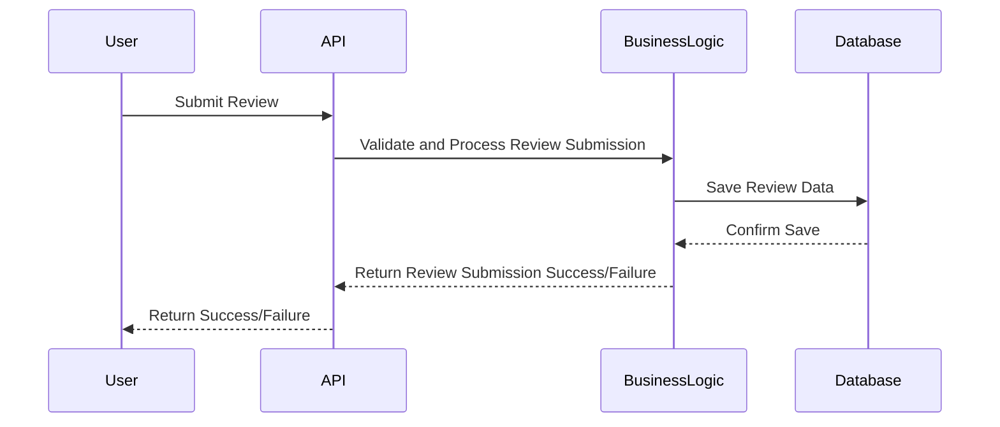
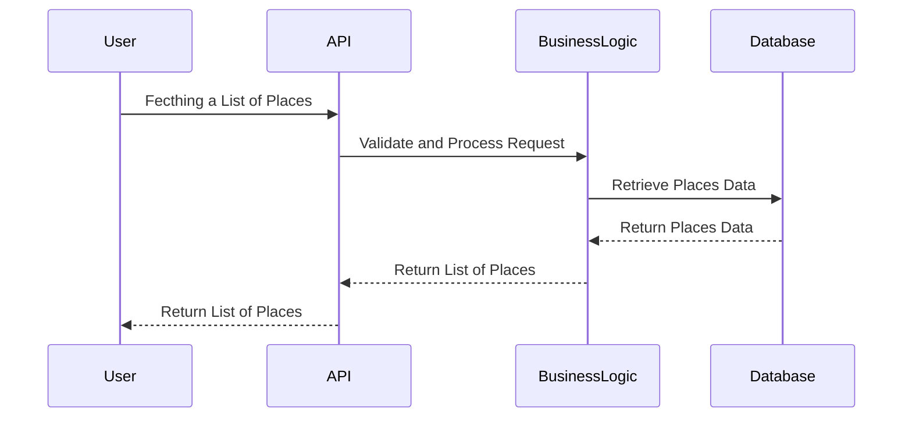

# **HBnB Evolution Technical Documentation**

This document serves as a detailed blueprint for the HBnB project. It guides the implementation phases and providing a clear reference for the system’s architecture and design. The document includes high-level and detailed diagrams along with explanatory notes to clarify design decisions, describe interactions, and outline the overall architecture of the application.

## **High-Level Architecture**

#### Notes:

- **Purpose**: This diagram provides an overview of the system's layered architecture
- **Key Components**:
    - **Presentation Layer**: Interfaces for assorted services including user interfaces   and API endpoints (e.g., UserService, PlaceService)
    - **Business Logic Layer**: Contains model classes and business logic, handling core functionalities and data processing.
    - **Persistence Layer**: Manages database access and repositories, ensuring data storage and retrieval.
- **Design Decisions**:
    - **Facade Pattern**: Used to simplify interactions between layers, providing a unified interface to a set of interfaces in the subsystem.
    - **Layer Approach**: Ensures separation of concerns and modularity, making the system easier to maintain and extend.
- **Overall Architecture**: This layered approach ensures separation of concerns and modularity, enhancing maintainability and scalability.

## **Business Logic Layer**

#### Notes:

- **Purpose**: This diagram details the classes in the business logic layer.
- **Key Components**:
    - **User**: Represents users with attributes (e.g., FirstName, email, password) and methods for registration, and profile management (e.g., register(), delete()).
    - **Place**: Represents places with attributes (e.g., title, price) and methods for creation and management (e.g., create(), list()).
    - **Security**: Authentification and authorization mechanisms to protect user data.
- **Overall Architecture**: This diagram shows how entities interact within the business logic layer, highlighting the core functionalities and interactions. For example, when a user crates a place, the system validates the input, processes the data, and updates the database accordingly. 
## **API Interaction Flow**

### Sequence Diagram User Registration

#### Notes:

- **Purpose**: Illustrates the flow of the user registration.
- **Key Components**: User, API, Business Logic, Database.
- **Design Decisions**:
    - **Validation**: Ensures data integrity and security during registration.
    - **Processing**: Manages user input and interacts with the database to store user information.
- **Overall Architecture**: Shows the interaction and data flow during user registration, ensuring seamless user experience. The user submits registration details, the API processes the request, the business logic validates and processes the data, and the database stores the user information.

### Sequence Diagram Place Creation

#### Notes:

- **Purpose**: Details the process to create a place.
- **Key Components**: User, API, Business Logic, Database.
- **Design Decisions**:
    - **Validation**: Ensures data accuracy and consistency before saving.
    - **Processing**: Manages user input and interacts with the database to create a new place.
- **Overall Architecture**: Demonstrates the steps involved in place creation, highlighting the interactions between different components. The user submits place details, the API processes the request, the business logic validates and processes the data, and the database stores the place information.

### Sequence Diagram Review Submission

#### Notes:

- **Purpose**: Shows the flow of submitting a review.
- **Key Components**: User, API, Business Logic, Database.
- **Design Decisions**:
    - **Validaion**: Ensures the quality and reliability of reviews before saving.
    - **Processing**: Manages user input and interacts with the database to store the review.
- **Overall Architecture**: Outlines the interaction and the data flow during review submisssion, ensuring a smooth and efficient process. The user submits a review, the API processes the request, the business logic validates and processes the data, and the database stores the review information.

### Sequence Diagram Fetching a List of Places

#### Notes:

- **Purpose**: Describes the process of retrieving a list of places.
- **Key Components**: User, API, Business Logic, Database.
- **Design Decisions**:
    - **Validation**: Ensures data accuracy and relevance before retrieval.
    - **Processing**: Manages user requests and interacts with the database to fetch place data.
- **Overall Architecture**: Demonstrates the steps involved in fetching place data, ensuring efficient data access and retrieval. The user requests a list of places, the API processes the request, the business logic layer validates and processes the data, and the database retrieves the places information. 

